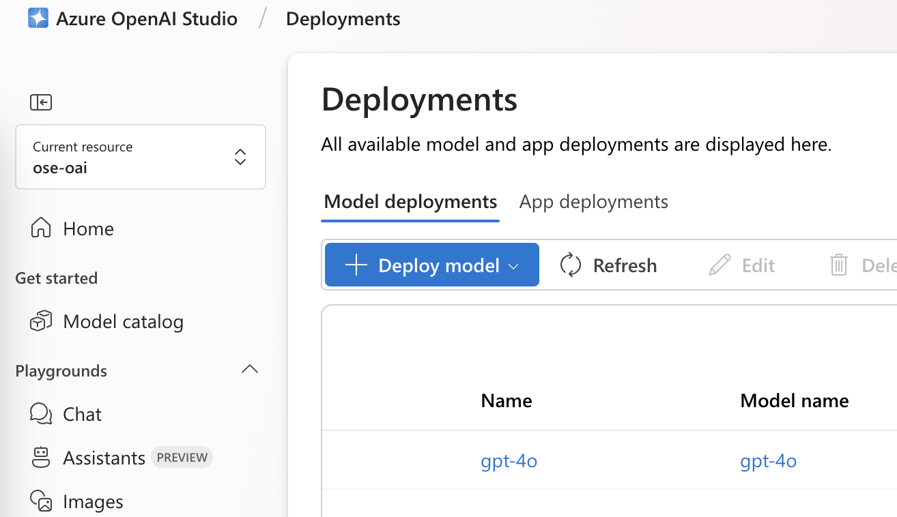
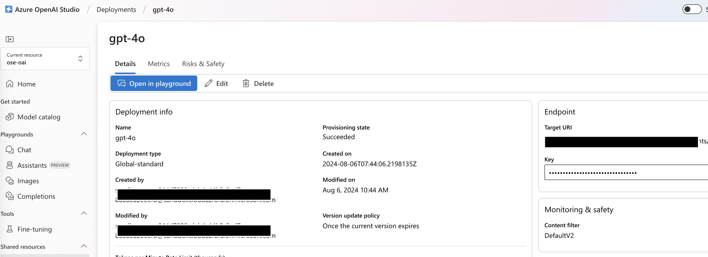

# Use Azure OpenAI from Python3 applications

This is a guide on how to configure a python3 script to access the Azure Open AI service directly though its API.

Using this implementation will alow a user to interact with AI models (known as deployments) through the API.

1. First step is to create a [Model deployment](https://learn.microsoft.com/en-us/azure/ai-services/openai/how-to/deployment-types) in the Azure Open AI studio. See image below: 
2. Once the model is deployed, you can view its settings: 
3. Take the endpoint and the API Key, these will be required in order to develop the Python3 app. These can be saved into an `.env` file for example, right next to the Python3 code.
```text
AZURE_OPENAI_APIKEY=<apikey>
AZURE_OPENAI_ENDPOINT=https://<deployment>
```
3. Navigate inside [`azure.py`](./azure.py) script and change the value of `MESSAGE`, as this will be used in the prompt object managed by the `prompt` method.
```python
MESSAGE = "Anything you want" # <--------- change this
payload = prompt(MESSAGE)
```
4. Execute `azure.py`.

### Updated client interface

Based on the [official Azure documentation](https://learn.microsoft.com/en-us/azure/ai-services/openai/tutorials/fine-tune?tabs=python-new%2Ccommand-line), the script `azure_v2.py` contains an alternative implementation that allows a user to interact with the models that are deployed in their Azure OpenAI instance.

Keep in mind that this version will require the following environment variables to be declared in the `.env` file:
```text
AZURE_OPENAI_APIKEY
AZURE_OPENAI_ENDPOINT
AZURE_OPENAI_ENDPOINT_2
AZURE_OPENAI_DEPLOYMENT
AZURE_OPENAI_API_VERSION
```

where `AZURE_OPENAI_ENDPOINT_2` will only contain the base URL of the endpoint, e.g., `https://deployment1.openai.azure.com/`. Make sure to include the trailing "/" at the end.

## Quickstart: Get started generating text using Azure OpenAI Service

Full guide [here](https://learn.microsoft.com/en-us/azure/ai-services/openai/quickstart?pivots=programming-language-python&tabs=command-line%2Cpython-new).
